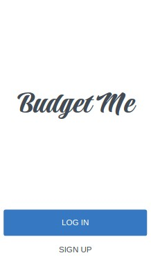

# Budget App

The Budget App is a mobile web application where you can manage your budget: you have a list of transactions associated with a category, so that you can see how much money you spent and on what.



## Built With

- 

## Live Demo
[Demo Available Here](https://calm-mesa-35128.herokuapp.com/)

## Getting Started

### Installation

1. Clone the repo

   ```sh
git clone git@github.com:the-catalystmc/budget-app.git   ```

### Usage

1. Install ruby gems dependencies

   ```sh
   bundle install
   ```

2. Install node dependencies

   ```sh
   npm install
   ```

3. Database creation

   ```
   rails db:setup
   ```

4. Run the web server

   ```sh
   rails server
   ```

5. Access to the website in a browser with the following link

   ```sh
   localhost:3000
   ```

### Test

1. For testing run:

   ```sh
   rspec
   ```

## Acknowledgements

- Use controllers to handle requests and render empty views.
- Install Ruby on Rails framework.
- Use Ruby Gems as a software packages system.
- Understand Rails naming conventions.
- Use params from browser requests in a safe way.
- Write tests for controllers.

## Author

👤 **Rhyine S**

- GitHub: [@the-catalystmc](https://github.com/the-catalystmc)
- Twitter: [@catalystspeaks](https://twitter.com/catalystspeaks)
- LinkedIn: [LinkedIn](https://linkedin.com/in/rhyine-stewart)

## 🤝 Contributing

Contributions, issues, and feature requests are welcome!

Feel free to check the [issues page](https://github.com/the-catalystmc/recipe-app/issues).

## Show your support

Give a ⭐️ if you like this project!

## 📝 License

This project is [MIT](https://github.com/git/git-scm.com/blob/main/MIT-LICENSE.txt) licensed.
